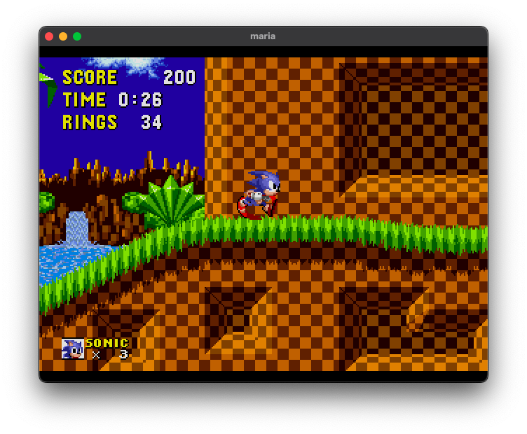

## maria

  

An extremely experimental Mega Drive emulator, just for my own testing and development. It's forked off kiwi and based on the MUSASHI m68k portable emulator written in C.

As of now, the emulator is pretty much identical to kiwi in terms of backend. Simply discarded some extra features like second controller input for now, and modified the memory addressing code to handle data sent to and read from EVA.

> Disclaimer: I primarily work on Mac systems and as is the project is configured for Mac. However, you may change the build system and compile under any other operating system with whatever compiler you like. The backend is built as a library that gets linked to the frontend. The only external dependencie is Raylib, a graphics an input framework.
